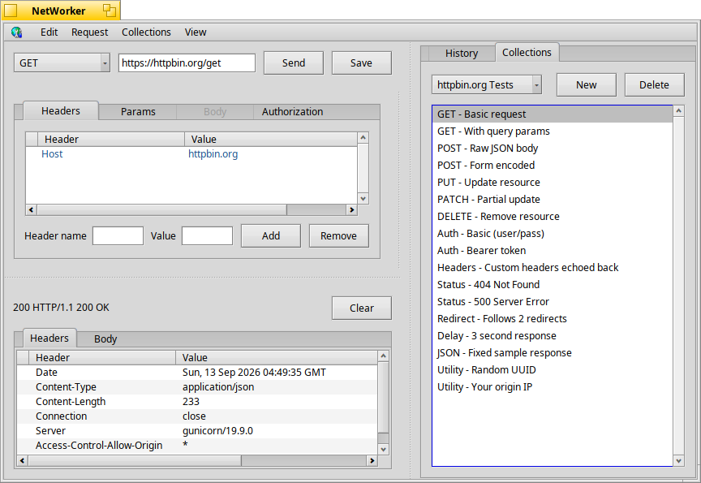

# NetWorker



**NetWorker** is a lightweight, Haiku-native REST API client, inspired by tools like Postman and HttpShout. Create, send, and inspect HTTP requests.

Built using the `netservices2` library.

Compose a request with method, URL, headers, form parameters, or a raw body, authenticate with Basic, Bearer, or API key auth. Each request is saved in a history list, and can be restored.

---

## Features

- **Request builder**
  - Method selector: GET, QUERY, POST, PUT, PATCH, DELETE
  - URL input with validation
  - Live request preview panel
  - Custom headers
  - Custom URL parameters

- **Request body**
  - Raw body editor
  - Form-encoded parameters (`application/x-www-form-urlencoded`) with an add/remove key-value editor
  - File attachment

- **Authorization**
  - None, Basic (username/password), Bearer token, and API key (custom header name/value)

- **Response viewer**
  - Status line
  - Response headers in a sortable column list
  - Response body view

- **History**
  - Auto-populated on every send (method, URL, body, params, and auth recorded)
  - Click an item to restore it into the request builder
  - Persists between sessions (optional, disabled by default)
  - Set max history items to keep (default 100)
  - Save history item to collection
  - Right-click menu for more options

- **Collections**
  - Import and export collections of requests
  - Example collection included (httpbin-test-collection.json)
  - Right-click menu for more options

---

## Build Instructions

To build the app:

```bash
make
```

---


## License

[MIT License](LICENSE)

---

## Contributions

Pull requests and suggestions are welcome.